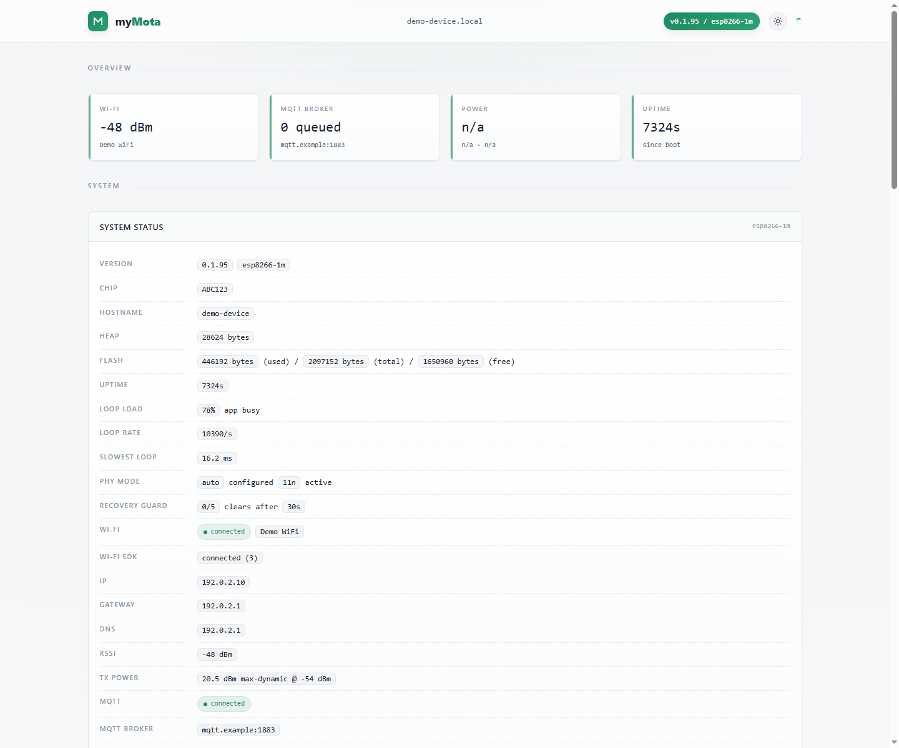
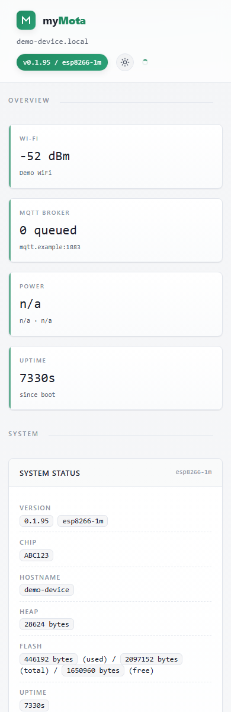
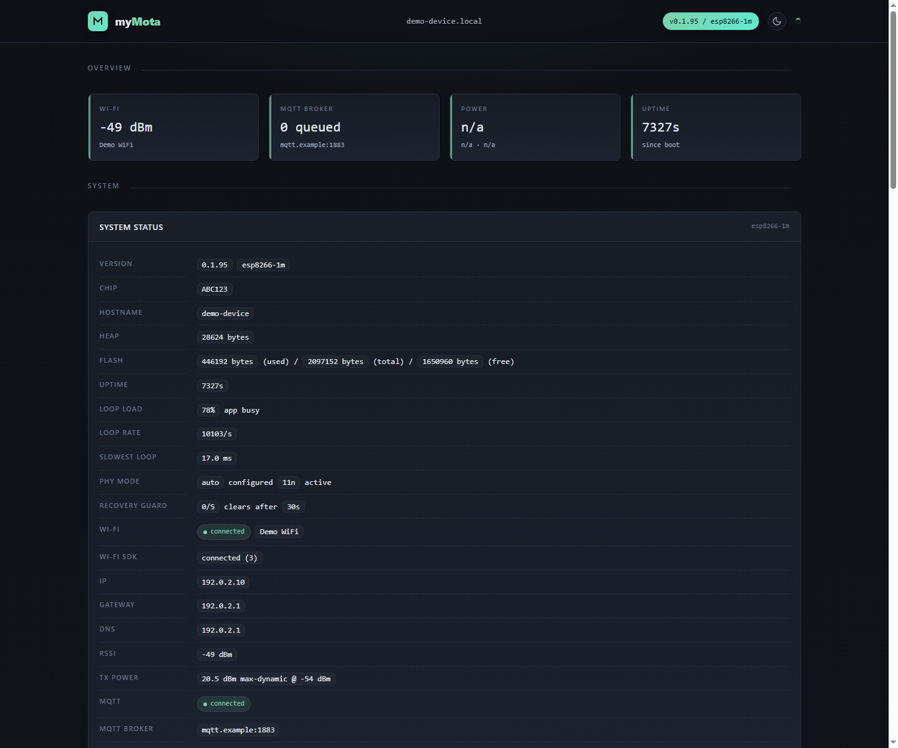
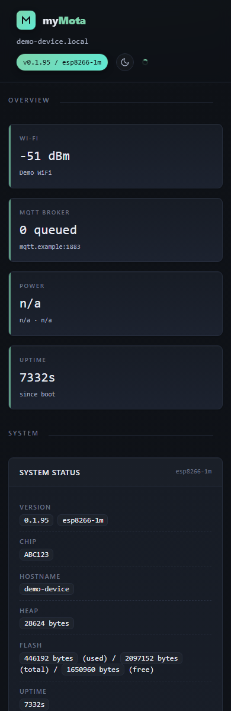

# myMota

A hat tip to [Tasmota](https://github.com/arendst/Tasmota): this project
exists because Tasmota proved how useful local, template-driven, MQTT-first
device firmware can be. myMota is an ESP8266/ESP8285 smart-home firmware built
for local control, Tasmota OTA migration, Tasmota-style hardware templates,
MQTT automation, energy monitoring, light control, and a compact device web UI.

A major reason to use myMota instead of full Tasmota on supported devices is
responsiveness. myMota intentionally does far fewer things than Tasmota, so its
web UI, button handling, MQTT paths, and device loop can stay fast and
predictable. That is not a criticism of Tasmota; it is the natural tradeoff of
Tasmota supporting a much broader range of hardware, drivers, protocols, and
features. myMota focuses on the ESP8266/ESP8285 devices used here and keeps the
firmware small enough for 1 MB flash targets.

myMota is intended for devices that should remain usable without a cloud
service. It exposes a browser UI for configuration, a `/health` JSON endpoint
for monitoring, Tasmota-like `/cm?cmnd=...` command handling, a simple
`/api/settings` compatibility endpoint, and MQTT command topics compatible with
common home-automation flows.

## Screenshots

The screenshots below are sanitized captures based on the live tester device
UI. All device identifiers, hostnames, network values, and credentials have
been replaced with placeholders.

| Light desktop | Light mobile |
| --- | --- |
|  |  |

| Dark desktop | Dark mobile |
| --- | --- |
|  |  |

## Highlights

- Tasmota OTA migration support for ESP8266 and ESP8285 devices.
- Direct serial flashing support for blank devices, bench recovery, and devices
  that cannot OTA boot.
- Tasmota-style JSON template paste support for ESP8266 layouts.
- Built-in template list for commonly used Shelly, NOUS, and Xiaomi-style
  devices.
- Local web UI with light and dark themes, overview tiles, live `/health`
  polling, firmware upload, settings import/export, and system controls.
- MQTT control and telemetry with Tasmota-like command topics.
- HTTP command support through `/cm?cmnd=...`.
- Relay, input, LED, PWM light, color light, Shelly dimmer, rotary encoder,
  energy monitoring, ADC temperature, and ADC button support.
- Recovery access point, boot recovery guard, target-checked OTA uploads, soft
  reboot, cold reboot, force reset, and factory reset paths.
- No HTTPS, TLS, MQTT authentication, or cloud integration is included by
  design.

## Supported Build Targets

The project builds 1 MB images for ESP8266 and ESP8285 devices:

- `esp8266-1m` for ESP8266 devices with external 1 MB flash.
- `esp8285-1m` for ESP8285 devices with internal 1 MB flash.

Use the image that matches the actual chip family. The firmware filename
includes the target, for example:

```text
dist/mymota-<version>-esp8266-1m.bin.gz
dist/mymota-<version>-esp8285-1m.bin.gz
```

The web UI checks uploaded filenames against the running target, and the
device-side upload handler rejects wrong-target uploads unless firmware target
verification is disabled in the UI.

## Building

PlatformIO is used for builds. The project uses the public Tasmota ESP8266
platform package and Arduino ESP8266 core 2.7.8 package.

Build the ESP8266 target:

```sh
pio run -e mymota-esp8266-1m
```

Build the ESP8285 target:

```sh
pio run -e mymota-esp8285-1m
```

Build both targets:

```sh
pio run -e mymota-esp8266-1m -e mymota-esp8285-1m
```

The raw PlatformIO firmware images are written below `.pio/build/`. Release
artifacts in `dist/` are named:

```text
mymota-<version>-<target>.bin
mymota-<version>-<target>.bin.gz
```

The gzip image is intended for OTA and web upload flows where free sketch space
is tight. The raw `.bin` image is useful for direct serial flashing.

Important build details:

- CPU frequency: 80 MHz.
- Flash frequency: 40 MHz.
- Flash mode: DOUT.
- Linker script: `eagle.flash.1m256.ld`.
- ArduinoJson 6.21.5 is the only declared library dependency.

## Switching From Tasmota

myMota is designed to be migratable from Tasmota over OTA.

1. Identify whether the device is ESP8266 or ESP8285.
2. Build or download the matching target image from `dist/`.
3. Open the Tasmota web UI and use its firmware upgrade page.
4. Upload the matching `mymota-<version>-<target>.bin.gz`.
5. After reboot, the device should come up in myMota. Configure Wi-Fi, MQTT,
   template, inputs, LEDs, relay enforcement, energy, and light settings from
   the myMota UI.

Do not cross-flash target variants. Use `esp8266-1m` for ESP8266 devices and
`esp8285-1m` for ESP8285 devices.

## Direct Flashing

Direct flashing is useful for first installation, UART recovery, or devices
that cannot OTA boot. Use the target-specific raw `.bin` image.

ESP8266:

```sh
esptool.py --chip esp8266 write_flash -fm dout -fs 1MB -ff 40m 0x0 dist/mymota-<version>-esp8266-1m.bin
```

ESP8285:

```sh
esptool.py --chip esp8266 write_flash -fm dout -fs 1MB -ff 40m 0x0 dist/mymota-<version>-esp8285-1m.bin
```

## Web UI

The root web UI is the primary configuration surface. It is organized into
overview, system, device, network, and maintenance areas.

- Overview tiles show Wi-Fi RSSI, MQTT queue depth, power, and uptime.
- System Status shows firmware version, target, chip ID, hostname, heap, flash
  usage, uptime, loop performance, PHY mode, recovery guard state, Wi-Fi state,
  gateway, DNS, RSSI, TX power, MQTT state, MQTT broker, and MQTT topic.
- Template shows the decoded hardware profile: relays, inputs, LEDs, PWM light
  channels, energy driver, ADC roles, I2C pins, Shelly dimmer serial pins, and
  unsupported template functions.
- Device controls show light, relay, and energy controls when supported by the
  active template.
- Inputs configure button mode, switch mode, press actions, hold actions, MQTT
  broadcasts, webhook actions, debounce, and hold timing.
- Device State Enforcement controls relay restore-at-boot, relay turn-on-at-boot,
  relay turn-back-on-after-off behavior, and light restore-at-boot.
- Relay Pulsing can automatically turn a relay back off after it has been on
  for a configured number of seconds.
- Wi-Fi stores SSID, password, hostname, PHY mode, and dynamic TX power.
- MQTT stores broker host, port, topic, native MQTT protocol keepalive, and
  state keepalive.
- System controls include firmware upload, power saving, soft reboot, cold
  reboot, force reset, and factory reset.
- Settings export/import allows moving device settings between devices without
  exporting Wi-Fi SSID or password.

## Templates

myMota accepts Tasmota-style template JSON by copy and paste. The parser reads
`NAME`, `GPIO`, `FLAG`, `BASE`, and the relevant GPIO function codes, then maps
supported functions to runtime relays, inputs, LEDs, PWM light channels, energy
drivers, ADC inputs, rotary encoders, I2C pins, serial energy devices, and
Shelly dimmer control pins.

Built-in templates:

- Mi Desk Lamp
- NOUS A1T
- NOUS A5T
- Shelly 1
- Shelly 1L
- Shelly 2.5
- Shelly Dimmer 2
- Shelly Duo RGBW
- Shelly Plug S

Unsupported template functions are listed in the UI so the user can see what
was ignored. Energy metering and light output support are implemented only for
the drivers currently present in the firmware.

## Relays, Inputs, Buttons, and LEDs

Relays can be controlled from the web UI, MQTT, `/cm`, button actions, switch
inputs, and relay enforcement. `POWER` and `POWER1` both map to relay 1 when
only one relay is available.

Inputs can operate as:

- Button actions: debounced press and hold events trigger an action.
- Switch follows output: physical switch state drives a relay or light.

Button actions can:

- Do nothing.
- Toggle a relay or light.
- Publish an MQTT topic and payload.
- Execute an HTTP webhook.

Action text supports placeholders such as `{BUTTONID}`, `{TYPE}`, `{TOPIC}`,
and relay state placeholders such as `{RELAY1_STATE}`. When a button has no
hold action configured, the press action fires immediately on the debounced
press edge for lower latency.

LED outputs can be attached to relay state, button state, Wi-Fi/MQTT state, or
left unattached depending on the decoded template and available pins.

## Device State Enforcement

Device State Enforcement controls startup and restoration behavior for relays
and lights when those outputs are present in the active template.

- Restore last state at boot can return relays to their saved state after boot.
- Turn on at boot can force a relay on during startup when restore-last-state is
  not selected.
- Time based restore can turn a relay back on after it has been off for a
  configured number of seconds.
- Light restore last state at boot can return a light to its saved power,
  dimmer, color temperature, and color state after boot.

Graceful reboots, such as firmware upgrades and soft reboot actions, save a
relay snapshot so devices can return to their pre-reboot state when configured
to do so. Cold reboot clears the graceful snapshot. Force reset skips normal
shutdown handling and uses the low-level reset path.

## Relay Pulsing

Relay Pulsing turns a relay back off after it has been switched on for a
configured number of seconds.

The timer starts whenever the relay is turned on from the web UI, MQTT,
Tasmota-style HTTP command, webhook, physical input, or other runtime firmware
path. Turning the relay off manually cancels the pending pulse. Pulse turn-off
does not trigger time-based restore-after-off enforcement.

## Light Support

Light controls are exposed when the active template contains supported PWM light
outputs or Shelly Dimmer 2 serial control pins.

Supported controls:

- Power on/off through `POWER`.
- Brightness through `DIMMER`.
- Color temperature through `CT` or `ColorTemperature`.
- RGB color through `Color`.
- Hue, saturation, brightness through `HSBColor`.
- White channel level through `White` on color-capable templates with a white
  channel.
- Shelly Dimmer 2 edge mode and dimmer range through the web UI and
  Tasmota-style commands.

The Shelly Duo RGBW template exposes RGB and white-channel control. The Shelly
Dimmer 2 template uses the dimmer MCU serial protocol for brightness, dimmer
settings, and energy readings.

## Energy Monitoring

Energy monitoring is enabled when the active template exposes a supported
metering driver.

Supported paths include:

- HLW8012 and HJL/BL0937 pulse metering using CF, CF1, and SEL pins.
- ADE7953 metering for Shelly 2.5 style dual-channel devices.
- CSE7766 serial metering for devices such as NOUS A5T.
- Shelly Dimmer 2 energy data from the dimmer MCU serial protocol.
- ADC temperature/raw ADC reporting where the template exposes ADC roles.

The UI shows voltage, current, power, total kWh, total offset, per-channel
details when available, and the age and reason of the last energy MQTT report.
MQTT energy reports can be sent on interval, on percentage power change, on watt
power change, when power drops to zero, and when relay-off conditions require a
final zero-watt report.

Energy reports publish to:

```text
stat/<topic>/STATUS8
```

with a Tasmota-style `StatusSNS.ENERGY` payload.

## MQTT

The built-in MQTT client connects to `host:port`, subscribes to:

```text
cmnd/<topic>/#
```

It publishes relay, light, energy, and button events using Tasmota-style topic
shapes where applicable.

Common commands:

```text
cmnd/<topic>/POWER ON
cmnd/<topic>/POWER OFF
cmnd/<topic>/POWER TOGGLE
cmnd/<topic>/POWER1 TOGGLE
cmnd/<topic>/DIMMER 50
cmnd/<topic>/CT 350
cmnd/<topic>/Color FF8000
cmnd/<topic>/HSBColor 30,100,80
cmnd/<topic>/White 50
cmnd/<topic>/DimmerRange 0,100
cmnd/<topic>/ShdLeadingEdge 1
```

MQTT settings include native protocol keepalive and state keepalive. Native
protocol keepalive controls MQTT PINGREQ/PINGRESP timing. State keepalive
periodically republishes relay and light state. The firmware does not include
MQTT TLS or username/password authentication.

## HTTP API

Useful endpoints:

- `/` - web UI.
- `/health` - JSON status document.
- `/cm?cmnd=POWER%20TOGGLE` - Tasmota-style command execution.
- `/api/settings` - simple settings compatibility endpoint.
- `/settings/export` - export JSON settings, excluding Wi-Fi credentials.
- `/settings/import` - import exported settings.
- `/update` - firmware upload endpoint.
- `/reboot-soft` - reboot while saving a graceful relay snapshot.
- `/reboot-cold` - reboot without preserving the graceful relay snapshot.
- `/force-reset` - low-level software reset recovery path.

`/api/settings` supports readback with no query parameters and supports GET
updates for commonly automated settings:

```text
/api/settings?power_saving=deep
/api/settings?wifi_dynamic_power=1
/api/settings?mqtt_protocol_keepalive=30
/api/settings?input1_topic=cmnd/demo/POWER&input1_payload=TOGGLE
```

The endpoint also accepts JSON through POST, PUT, or PATCH for the same
settings families.

The `/health` document includes firmware version, target, chip ID, flash usage,
power saving mode, Wi-Fi state, MQTT state, template summary, relay state,
button state, LED state, light state, energy state, ADC state, and recovery
guard state.

## Wi-Fi and Recovery

The Wi-Fi page stores SSID, password, hostname, PHY mode, and dynamic Wi-Fi TX
power. Dynamic TX power is enabled by default and can reduce transmit power
after the link is stable:

- RSSI >= -40 dBm: 10 dBm TX power.
- RSSI >= -50 dBm: 13 dBm TX power.
- RSSI below -50 dBm: maximum TX power.

Power saving modes are:

- Off: no intentional loop delay.
- Light: 1 ms delay after loop work.
- Deep: 10 ms delay after loop work.

If Wi-Fi is not configured, the firmware starts a setup access point using the
default device hostname. If station mode has never connected and remains
offline during startup, the firmware can start the recovery AP after the
fallback timeout.

The boot recovery guard tracks repeated fast failed boots. The default guard is
5 fast boots with a 15 second stable window, and both values can be adjusted in
the System card. After the configured limit, it can clear saved settings so the
device returns to the setup AP instead of remaining trapped in an unusable
configuration.

## OTA and Reset Paths

The firmware upload form accepts `.bin` and `.bin.gz` images. When target
verification is enabled, both browser-side JavaScript and the device-side upload
handler require the filename to contain the running target name.

The upload path pauses MQTT, saves relay/light/energy state where appropriate,
writes through the ESP8266 updater, and schedules a dedicated OTA restart.

System reset paths:

- Reboot Soft saves the graceful relay snapshot before restarting.
- Reboot Cold clears the graceful relay snapshot before restarting.
- Force Reset skips normal shutdown handling and performs a low-level reset.
- Factory Reset clears saved settings and restarts.

## Settings Export and Import

Settings export produces a JSON document that includes system, dynamic Wi-Fi TX
power, template, MQTT, energy, light, LED, relay enforcement, and input
settings.

Wi-Fi SSID and Wi-Fi password are deliberately not exported or imported.

## License

myMota is released under the MIT License. See `LICENSE`.
